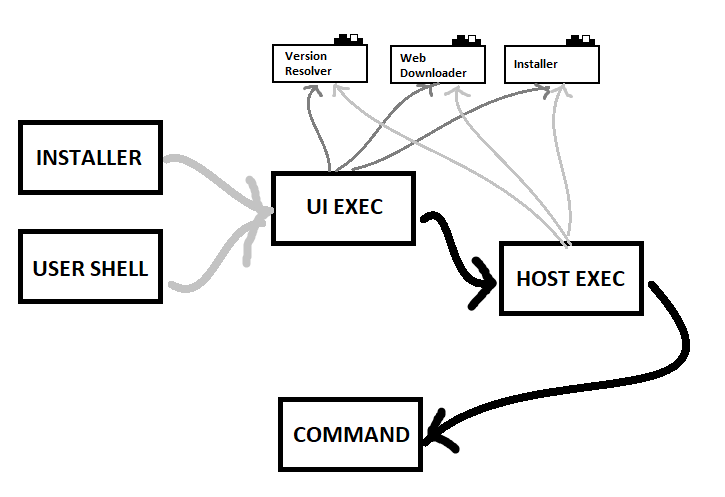

# OBJETIVO GERAL DO PROJETO

## SINOPSE

Ser uma ferramenta mínima, extensível, independente e autosuficiente
para o desenvolvimento de software multiplataforma.

## DETALHES
Montar um ambiente de desenvolvimento para qualquer que seja a plataforma
é hoje uma tarefa trivial para um desenvolvedor experiente, e ao mesmo
tempo um desafio obscuro para quem está iniciando na área. Até mesmo para
os mais experientes torna-se uma tarefa (apesar de trivial) árdua,
dependendo dos componentes que o software usa; quanto mais componentes,
mais tempo se gasta, seja em tempo para montar documentação de
pré-requisitos, ou em scripts de automação.

Certo que temos uma série de ferramentas modernas disponíveis atualmente,
e outra série de serviços na nuvem que facilitam esse trabalho, mas até
mesmo aos mais experientes, não é tão simples conseguir reunir um conjunto
adequado entre essas várias ferramentas e serviços para atender a
peculiaridades de um projeto em particular; que por vezes pode necessitar
de uma combinação atípica dessas tecnologias, e nem sempre elas se
relacionam naturalmente, necessitando de certas customizações.

Para essa ferramenta, propomos as seguintes premissas:

1. Ser o mínimo necessário para possibilitar portabilidade
   para vários sistemas operacionais, e leve o suficiente para
   um bootstrap rápido;

2. Ser extensível para que se possa adicionar funcionalidades
   o quanto for necessário, sustentando inclusive uma
   comunidade e ecossistema próprio;

3. Ser independente de pré-requisitos de software, a não ser os
   essenciais: Shell e requisição à Internet;

4. Ser autosuficiente para que resolva suas dependências e
   extensões na execução de um único script shell sem
   argumentos;
			   
Trata-se de um mecanismo de construção de softwares autosuficiente, e um
conjunto de funcionalidades para auxiliar o desenvolvedor na tarefa de
construção de softwares nessas condições.

# COMPONENTES



## SINOPSE

Instalador, Executável UI, Executável Host e Comando.


## DETALHES

Esses quatro componentes descrevem toda a arquitetura da ferramenta.
Em seguida temos uma descrição mais detalhada de cada uma, mas o gráfico
abaixo mostra o relacionamento e a interação entre elas.

```
    +-(*)--------+      +---------------+   
    | Instalador | >>-> | Executável UI | >>-+
    +------------+      +---------------+    |
                                             |
    +---------+      +-----------------+     |
    | Comando | <-<< | Executável Host | <---+
    +---------+      +-----------------+
```		
Esses componentes funcionam como um pipeline de executáveis, um primeiro
vai chamando os próximos até chegar no item mais específico que realizará
a ação solicitada propriamente dita.

* O instalador aqui é um item que é chamado somente na primeira execução.
  Uma vez instalado as próximas chamadas cairão já diretamente no
  "Executável UI".


# INSTALADOR

## SINOPSE

Script/Comando para instalar o mecanismo.


## DETALHES

O instalador é um script capaz de instalar o "EXECUTÁVEL UI" na máquina
de um hospedeiro. É também um comando de única linha que pode ser copiado
e colado em um shell para que o processo de instalação inicie.
			
O resultado é uma forma simples e fácil de começar a trabalhar no modelo
proposto.
			
### Falando em modelo proposto, segue uma nota:
			
> Um dos motivadores para construção dessa ferramenta é o fato de
  pretender-se solucionar o problema dos que querem iniciar no mundo do
  desenvolvimento de software, mas que tem sua carreira muitas vezes
  interrompida, devido a frustração de, por não ter a experiência, não
  conseguir montar um ambiente suficiente em tempo razoável para que em
  fim possa escrever a primeira linha de código.

> O que queremos entregar é uma solução onde um iniciante copie um texto,
  cole em seu shell, execute um comando simples de bootstrap para seu
  ambiente pretendido, e comece a codificar.

# EXECUTÁVEL UI

## SINOPSE

Executável capaz de resolver a versão do host e chamá-lo repassando os
parêmetros.

## DETALHES

Por se tratar de uma ferramenta de desenvolvimento, essa será incorporada
a outros projetos de software, que por sua vez terão sua própria vida;
por outro lado essa ferramenta também é um software, o que nos diz que ela
irá evoluir. Essa evolução irá acarretar em muitas mudanças, que por muitas
vezes tornarão uma versão totalmente diferente da outra.
			
Não podemos presumir que todos os softwares que utilizem essa ferramenta
estejam sempre atualizando seus códigos para garantir a compatibilidade e
a evolução. Até porque, por muitas vezes uma versão primitiva pode atender
as necessidades de um determinado projeto, e se for assim, porque atualizar?

Dizemos essas linhas acima para embasar a necessidade de termos versionamento
nessa ferramenta. Assim pode se ter um projeto que use a ferramenta na versão
1.0.0 e outro que use na versão 1.7.3 e outra na 2.9.4. Cada ferramenta com
suas peculiaridades, e ambas devem funcionar adequadamente para construir seu
software sem causar quebras.

Por isso nós precisamos de um "Executável UI" e outro "Executável Host".

A responsabilidade do "Executável UI" é simplesmente identificar em qual
versão se pretende executar a ferramenta e carregá-la caso ainda não esteja
disponível no sistema (baixando da Internet) e em seguida repassar os
parâmetros para a mesma.

O "Executável UI" não precisa de muita complexidade, por isso espera-se que
ele não mude tanto com o passar do tempo, portanto uma versão inicial deve ser
capaz de chamar inclusive um host que foi escrito "no futuro". Esse pode até
sofrer mudanças em sua implementação, mas a sua definição essencial deve
permanecer por muito tempo bem parecida com o que está descrita neste
documento desde sua primeira versão.

Em resumo é como se pudéssemos ter um executável `bit` e outros `bit-1.0.0`,
`bit-1.7.3` e `bit-2.9.4`. Na linha de comando precisamos chamar somente:

```sh
$ bit arguments...
```

e por traz o executável `bit` (que é o Executável UI) identifica a versão mais
recente `bit-2.9.4` e repassa a responsabilidade:

```sh
$ bit-2.9.4 arguments...
```
poderia ainda informar uma versão específica:

```sh
$ bit @1.7.3 arguments
```

e por traz o executável repassaria a responsabilidade:

```
$ bit-1.7.3 arguments...
```

O uso de versionamento é bastante útil para manter o processo de build íntegro
durante o futuro. E o "Executável UI" serve para esse propósito.

# EXECUTÁVEL HOST

## SINOPSE

A ferramenta em si.

## DETALHES

O "Executável Host" é a ferramenta em si, que terá vida própria e evoluirá
conforme o tempo, com seu ecossistema distinto.
			
A responsabilidade do "Executável Host" é decodificar os argumentos e o comando
solicitado, preparar o contexto de ambiente, e repassar a responsabilidade
de execução da tarefa ao comando em si.

Nesse instante vale ressaltar que o comando também é resolvido e baixado da
Internet se necessário para que possa ser chamado.

O "Executável Host" também é responsável por fornecer o ambiente mínimo
necessário para que os comandos possam cumprir o papel de ser autosuficiente.
Para isso fornece funcionalidades como, "compactação" e "descompactação" de
conteúdo, "download", "configuração", e vários outros utilitários mais básicos.
Com isso o comando em si, fica com a responsabilidade de atender a necessidade
da tarefa, sem se preocupar com os "por menores".

# COMANDOS DO DESENVOLVEDOR/BUILD/CI

## SINOPSE

Comando que executa uma única tarefa automatizada distinta. Seja em uma máquina de desenvolvimento ou de build em uma integração contínua.

## DETALHES

Um comando é um arquivo de código que executa uma tarefa distinta que auxilia
o processo de desenvolvimento de software, é também um software suficiente,
que depende única e exclusivamente do contexto previamente fornecido pelo
"Executável Host".
			
Esse comando não tem muita liberdade de chamar dependências de bibliotecas de
terceiros (talvez isso mude com o tempo), mas deve trabalhar na limitação do
contexto estabelecido. Isso a princípio parece ser um ponto "contra", mas é na verdade
uma forma de atender a premissa 1 e 4 (mínimo e auto-suficiente), porque as
tarefas de build devem ser bastante específicas e executadas o mais rápido
possível, e se não puder ser codificada em um comando, talvez haja uma
responsabilidade demasiada sobre o mesmo. Nesse momento já podemos enxergar essa
limitação de contexto como um ponto "positivo" e não mais um "contra", porque limitamos à construção de comandos curtos.
			
Os comandos podem chamar subcomandos, que na verdade são somente outros comandos
conhecidos que são delegados por um comando e não diretamente pelo host (na
verdade pode ser simplesmente um retorno de redirect que o comando devolve para
o host, e o host sabe que deve chamar outro comando). Os comandos também tem
informações de ajuda, etc., bem como são versionados também.

Os comandos formam as bibliotecas do ecossistema, esses são dependentes de
versões específicas de host, que são verificadas,

# PROBLEMAS CONHECIDOS

1. O "atualizar path do usuário": Windows com problemas de falhas na execução
do utilitário, ou HKEY para regedit. O Linux que não permite atualizar as
variáveis do chamador, ou a falta do comando "source" e sua insuficiência para
resolver o problema. Apresentar a artimanha dos arquivos TXT atualizados pelo
executor "e5r-dev.js" e inclusos blocos de script nos arquivos de perfil
(".profile", ".bashrc", ".zhrc");

a) `$ dev exec "command"` para não precisar usar atualização de PATH

2. Trabalhos ascíncronos com JavaScript (nodejs) versus dependências e tamanho
do .NET Core como engine. JavaScript x C#;

