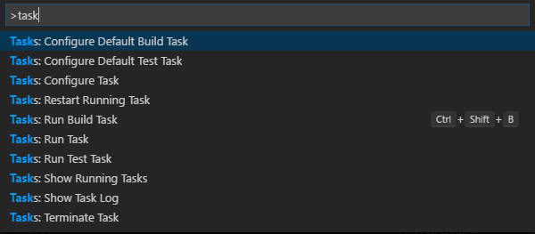
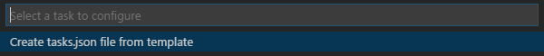
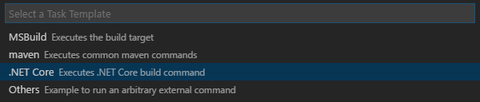
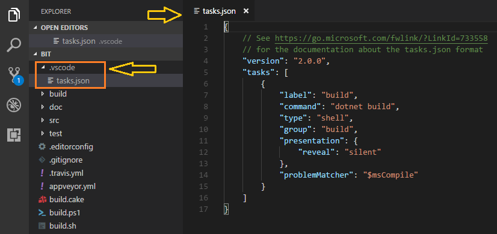
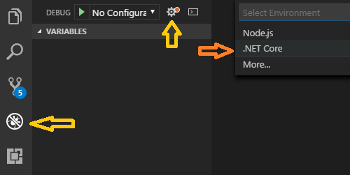
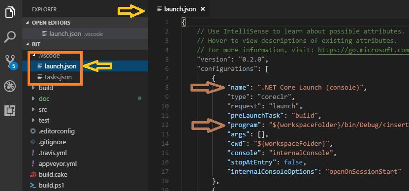

# E5R.Tools.Bit

Uma ferramenta mínima, extensível, independente e auto-suficiente para o desenvolvimento de software multiplataforma.

## Premissas:

* Ser o mínimo necessário para possibilitar portabilidade a vários sistemas operacionais, e leve o suficiente para um bootstrap rápido;

* Ser extensível para que se possa adicionar funcionalidades o quanto for necessário, sustentando inclusive uma comunidade e ecossistema;

* Ser independente de pré-requisitos de software, a não ser os essenciais: Shell e Internet;

* Ser auto-suficiente para que resolva suas dependências e extensões na execução de um único script shell sem argumentos;

## Build

### Build Status

Branch | AppVeyor | Travis-CI
------ | -------- | ---------
master | [](https://ci.appveyor.com/project/erlimar/bit/branch/master) | [](https://travis-ci.org/e5r/bit)
develop | [](https://ci.appveyor.com/project/erlimar/bit/branch/develop) | [](https://travis-ci.org/e5r/bit)

### Building on Windows:

```powershell
# Show help information
$ .\build.ps1 --help

# Show build options
$ .\build.ps1 --showdescription
```

### Building on Unix:

```sh
# Show help information
$ ./build.sh --help

# Show build options
$ ./build.sh --showdescription
```

> Mais detalhes nos arquivos [IDEA.md.](IDEA.md) e [DRAFT.md](DRAFT.md)

## Desenvolvendo com Visual Studio Code

### Pré-requisitos

1. [PowerShell](https://github.com/PowerShell/PowerShell)
2. [Visual Studio Code](https://github.com/Microsoft/vscode)
3. [C# para Visual Studio Code](https://github.com/OmniSharp/omnisharp-vscode)

### Etapas de configuração

Considerando que você já adquiriu o código do __E5R.Tools.Bit__ e está na
pasta do mesmo em uma sessão do __PowerShell__:

#### Configure os componentes .NET e aba o VSCode:

```powershell
# Se tiver problemas com a política de execução de scripts
Set-ExecutionPolicy Bypass CurrentUser

# Para baixar os componentes .NET necessários
.\build.ps1 -Target=Bootstrap

# Para garantir que você está usando a instalação
# correta do .NET SDK em "build/.dotnetsdk"
$env:Path = (Join-Path (Pwd) "build/.dotnetsdk") + ";${env:Path}"

# Para abrir o Visual Studio Code
code .
```

#### Crie a tarefa de build

1. Pressione `[CTRL + P]` (no Windows  Linux), ou `[Command + P]` (no macOS), e
selecione a opção __"Tasks: Configure Default Build Task"__;



2. Escolha __"Create tasks.json file from template"__;



3. Em seguida escolha a opção corresponente ao __".NET Core ..."__;



4. Por fim, isso criará o aquivo `.vscode/tasks.json`, conforme abaixo:



> __PS:__ Esse diretório (`.vscode`) é ignorado nos _commits_ do git
> para o projeto (veja o arquivo `.gitignore`), por isso cada desenvolvedor deve
> configurá-lo novamente. Isso é também muito importante porque o editor/IDE é
> uma escolha de cada desenvolvedor e não uma restrição do projeto.

#### Crie a configuração de depuração

1. Clique no ícone _Debug_ ou pressione `CTRL + Shift + D`(no Windows e Linux), ou
`[Command + Shif + D]` no macOS);



2. Então clique no ícone _Configure or Fix 'launch.json'_ e escolha a opção _.NET Core_;

3. Isso criará o aquivo `.vscode/launch.json`, conforme abaixo:



Sugerimos remover todas as outras configurações, deixando somente a primeira:
_.NET Core Launch (console)_, e também sugerimos nomeá-la de __E5R.Tools.Bit (Debug)__.

4. Ajuste o valor `program` no `JSON` conforme abaixo:

```json
"program": "${workspaceFolder}/src/E5R.Tools.Bit/bin/Debug/netcoreapp2.0/bit.dll"
```

5. Por fim você deve terminar com um arquivo `.vscode/launch.json` semelhante a este:

```json
{
  "version": "0.2.0",
  "configurations": [
    {
      "name": "E5R.Tools.Bit (Debug)",
      "type": "coreclr",
      "request": "launch",
      "preLaunchTask": "build",
      "program": "${workspaceFolder}/src/E5R.Tools.Bit/bin/Debug/netcoreapp2.0/bit.dll",
      "args": [],
      "cwd": "${workspaceFolder}",
      "console": "internalConsole",
      "stopAtEntry": false,
      "internalConsoleOptions": "openOnSessionStart"
    }
  ]
}
```

Isso deve ser o suficiente para você coloca seu `break point` e rodar sua cópia de
__E5R.Tools.Bit__ em modo de depuração.